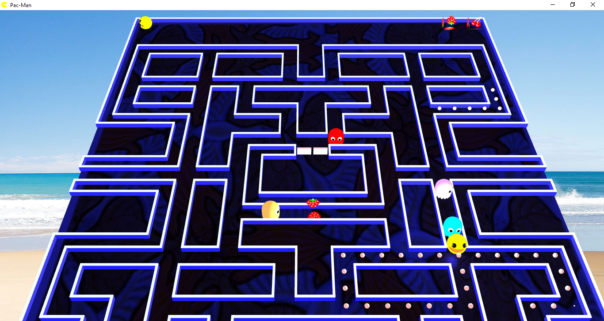

## Pac-Man and Ms. Pac-Man (game logic,  no UI)

A Pac-Man and Ms. Pac-Man game implementation with levels, timing, ghost "AI" etc. following the details given in the (highly appreciated) [Pac-Man Dossier](https://pacman.holenet.info) by Jamey Pittman. The Ms. Pac-Man levels probably are not 100% accurate because I could not find a similarly detailed description as the Pac-Man dossier. Any hints? 

The code in this project is more "to the point" than the one in my other [state-machine focussed implementation](https://github.com/armin-reichert/pacman).

The implementation follows the Model-View-Controller design pattern:
- The game controller is a [finite-state machine](pacman-core/src/main/java/de/amr/games/pacman/lib/FiniteStateMachine.java) with states
  -  INTRO, READY, HUNTING, LEVEL_STARTING, LEVEL_COMPLETE, PACMAN_DYING, GHOST_DYING, GAME_OVER and INTERMISSION. 
- The UI is decoupled from the controller by a small interface [PacManGameUI](pacman-core/src/main/java/de/amr/games/pacman/ui/PacManGameUI.java) and by a [game event listener](pacman-core/src/main/java/de/amr/games/pacman/controller/event/PacManGameEventListener.java) interface.

The strict separation should enable developers to create different user interfaces for Pac-Man and Ms. Pac-Man without having to recreate the details of the game logic. As proof of concept I implemented the following two UI variants: 
- A Swing UI implementation, see repository [pacman-ui-swing](https://github.com/armin-reichert/pacman-ui-swing).
- A JavaFX UI implementation with play scenes in 2D and 3D, see repository [pacman-javafx](https://github.com/armin-reichert/pacman-javafx).

YouTube:

### Build

`mvn clean install`

### Intro scene

### Pac-Man play scene

### Ms. Pac-Man play scene (2D vs. 3D)

